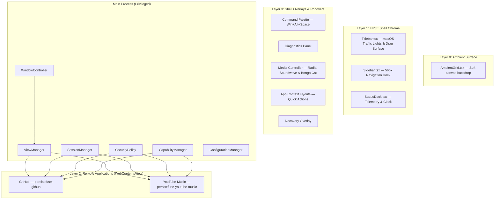
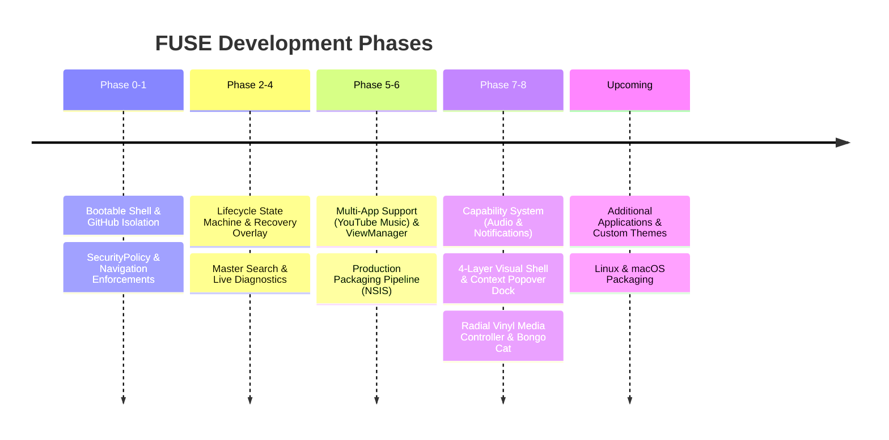

<div align="center">

# FUSE

**Your applications. One place. Your way.**

A keyboard-first, security-hardened desktop shell for hosting persistent web applications — GitHub, YouTube Music, and beyond — in one unified, customizable environment.

[]()
[]()
[]()
[]()

</div>

---

## What is FUSE?

FUSE is a native Electron desktop shell that hosts real web applications — not as browser tabs, but as first-class, isolated citizens inside a custom-built application window. Each hosted application gets its own persistent, sandboxed session, its own security policy, its own declarative capability set, and its own lifecycle — while FUSE itself provides the chrome: a minimalist titlebar, an Arch-style navigation dock with context action flyouts, a keyboard-first command palette, an animated radial media controller, and live diagnostics.

Think of it as a purpose-built alternative to keeping a dozen browser tabs pinned — except every "tab" behaves like a real app: it keeps running in the background, remembers who you are, and can never reach into your filesystem or another app''s data.

> **Current milestone:** **FUSE 0.8 (Phase 8)** — Full Capability System (audio/media/notifications), 4-Layer UI architecture, Minimalist macOS-style titlebar with vector traffic lights, Arch-style context action popovers, Radial Vinyl Media Controller with Bongo Cat, and Invisible Spatial Grid snapping.

---

## Table of Contents

- [Why FUSE](#why-fuse)
- [Architecture](#architecture)
- [Security Model](#security-model)
- [Capability System](#capability-system)
- [Application Lifecycle](#application-lifecycle)
- [Visual Shell & UI](#visual-shell--ui)
- [Tech Stack](#tech-stack)
- [Getting Started](#getting-started)
- [Project Structure](#project-structure)
- [Keyboard Shortcuts](#keyboard-shortcuts)
- [Diagnostics](#diagnostics)
- [Hosted Applications](#hosted-applications)
- [Roadmap](#roadmap)
- [Development Philosophy](#development-philosophy)

---

## Why FUSE

Browser tabs are a poor home for applications you use every day. They lose their place, share cookies and storage in ways you did not choose, offer no keyboard-first way to jump between them, and give you no visibility into what they are actually doing.

FUSE takes a different approach:

- **Real isolation.** Every hosted application lives in its own Electron session partition. GitHub and YouTube Music can never see each other''s cookies, storage, or login state.
- **Real security.** Hosted content runs with `nodeIntegration: false`, `contextIsolation: true`, and a default-deny navigation/permission policy — verified empirically, not just configured and assumed.
- **Real persistence.** Sign in once. Close FUSE. Reopen it. You are still signed in — per application, independently. Window bounds and maximized states are preserved across multi-monitor setups.
- **Real capabilities.** Background audio detection, media session routing, and notification tracking without breaching process boundaries.
- **Keyboard-first & Minimalist.** A global command palette (`Win + Alt + Space`) puts every application and action one keystroke away, paired with an unobtrusive minimalist titlebar.

---

## Architecture

FUSE enforces a strict 4-layer UI and process hierarchy:



---

## Capability System

Phase 7 introduced declarative application capabilities, managed via `CapabilityManager`:

```typescript
export interface AppCapabilities {
  audioPlayback?: boolean;
  mediaControls?: boolean;
  notifications?: boolean;
  badge?: boolean;
}
```

- **Background Audio Detection**: Detects audio playback in real time across backgrounded views.
- **Global Media Keys**: Routes playback commands (`play`, `pause`, `next`, `prev`) directly to media views.
- **Notification Interception**: Aggregates application notification events for shell badges.

---

## Visual Shell & UI

Phase 8 elevates FUSE with a refined visual identity:

1. **Ultra-Minimalist Titlebar**: Authentic 14px vector SVG macOS traffic lights (`×`, `—`, `◤◢`) with simultaneous cluster hover effects and a clean window dragging surface.
2. **Arch / Hyprland Context Action Flyouts**: Hovering over app icons opens anchored quick action cards (Play/Pause, Next Track, Repositories, Notifications, Reload Tab).
3. **Radial Vinyl Media Controller**: Animated circular album art surrounded by pulsing equalizer soundwaves, timeline scrubber, source selector, and an animated Bongo Cat beat companion.
4. **Invisible Spatial Layout Grid**: 8px layout snapping helper (`spatialGrid.ts`) for floating modals and cards.

---

## Tech Stack

| Layer | Technology |
|---|---|
| Shell runtime | Electron 32 |
| Language | TypeScript (strict mode) |
| UI | React 18 |
| Build tooling | Vite via `electron-vite` |
| Packaging | `electron-builder` |

---

## Getting Started

```bash
git clone https://github.com/Jaiminsinh-Dodiya/FUSE.git
cd FUSE
npm install
npm run dev
```

| Command | Purpose |
|---|---|
| `npm run dev` | Launch FUSE in development mode with hot reload |
| `npm run typecheck` | Strict TypeScript check across main, preload, and renderer |
| `npm run build` | Production build via `electron-vite` |
| `npm run package` | Package a distributable Windows build via `electron-builder` |

**Requirements:** Node.js ≥ 20.

---

## Keyboard Shortcuts

| Shortcut | Action |
|---|---|
| `Win + Alt + Space` | Open Master Search (command palette) |
| `↑` / `↓` | Navigate command palette results |
| `Enter` | Execute selected command |
| `Esc` | Close overlays / command palette |

---

## Roadmap



---

<div align="center">

Built with Electron, TypeScript, React, and a lot of deliberate, tested, incremental progress.

</div>
