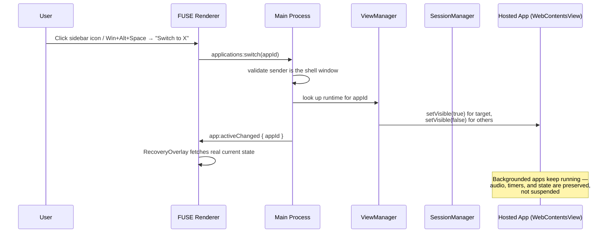
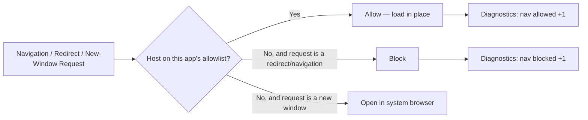
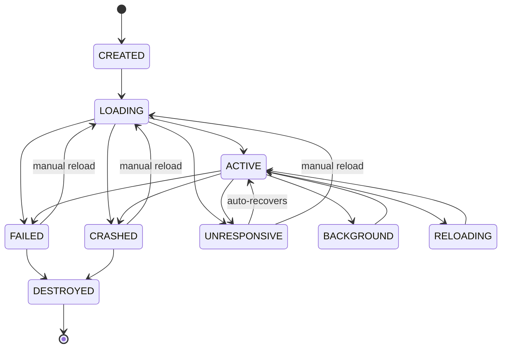
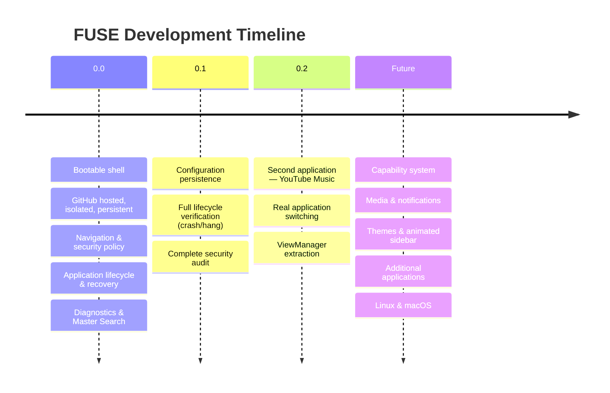

<div align="center">

# FUSE

**Your applications. One place. Your way.**

A keyboard-first, security-hardened desktop shell for hosting persistent web applications — GitHub, YouTube Music, and beyond — in one unified, customizable environment.

[]()
[]()
[]()
[]()

</div>

---

## What is FUSE?

FUSE is a native Electron desktop shell that hosts real web applications — not as browser tabs, but as first-class, isolated citizens inside a custom-built application window. Each hosted application gets its own persistent, sandboxed session, its own security policy, and its own lifecycle — while FUSE itself provides the chrome: a custom titlebar, a sidebar for switching between apps, a keyboard-first command palette, and live diagnostics.

Think of it as a purpose-built alternative to keeping a dozen browser tabs pinned — except every "tab" behaves like a real app: it keeps running in the background, remembers who you are, and can never reach into your filesystem or another app's data.

> **Current milestone:** FUSE 0.2 — two real hosted applications (GitHub, YouTube Music), a complete security-verified trust boundary, real application switching, and a fully tested crash-recovery lifecycle.

---

## Table of Contents

- [Why FUSE](#why-fuse)
- [Architecture](#architecture)
- [Security Model](#security-model)
- [Application Lifecycle](#application-lifecycle)
- [Tech Stack](#tech-stack)
- [Getting Started](#getting-started)
- [Project Structure](#project-structure)
- [Keyboard Shortcuts](#keyboard-shortcuts)
- [Diagnostics](#diagnostics)
- [Performance](#performance)
- [Hosted Applications](#hosted-applications)
- [Roadmap](#roadmap)
- [Development Philosophy](#development-philosophy)
- [Contributing](#contributing)

---

## Why FUSE

Browser tabs are a poor home for applications you use every day. They lose their place, share cookies and storage in ways you did not choose, offer no keyboard-first way to jump between them, and give you no visibility into what they are actually doing.

FUSE takes a different approach:

- **Real isolation.** Every hosted application lives in its own Electron session partition. GitHub and YouTube Music can never see each other's cookies, storage, or login state.
- **Real security.** Hosted content runs with `nodeIntegration: false`, `contextIsolation: true`, and a default-deny navigation/permission policy — verified empirically, not just configured and assumed.
- **Real persistence.** Sign in once. Close FUSE. Reopen it. You are still signed in — per application, independently.
- **Real lifecycle.** Applications are tracked through an explicit state machine — loading, active, backgrounded, failed, crashed, recovering — with a real recovery UI, not a silently blank window.
- **Keyboard-first.** A global command palette (`Win + Alt + Space`) puts every application and action one keystroke away.

---

## Architecture

FUSE draws a hard line between **privileged code** (the main process), **trusted local UI** (the FUSE renderer), and **untrusted remote content** (hosted applications). Nothing in the untrusted layer can reach anything in the privileged layer except through a deliberately narrow bridge.

```mermaid
graph TB
    subgraph "Main Process — privileged"
        WC[WindowController]
        VM[ViewManager]
        SM[SessionManager]
        SP[SecurityPolicy]
        AR[AppRegistry]
        CM[ConfigurationManager]
        CR[CommandRegistry]
        DC[DiagnosticsCollector]
    end

    subgraph "Preload — narrow typed bridge"
        PB["window.fuse.*<br/>(versions, windowControls,<br/>applications, commands, diagnostics)"]
    end

    subgraph "FUSE Renderer — trusted local UI"
        TB[Titlebar]
        SB[Sidebar]
        CP[Command Palette]
        DP[Diagnostics Panel]
        RO[Recovery Overlay]
    end

    subgraph "Application Layer — untrusted remote content"
        GH["GitHub<br/>WebContentsView"]
        YT["YouTube Music<br/>WebContentsView"]
    end

    VM -->|creates & wires| GH
    VM -->|creates & wires| YT
    SM -->|isolated session per app| GH
    SM -->|isolated session per app| YT
    SP -->|navigation / popup / permission policy| GH
    SP -->|navigation / popup / permission policy| YT
    WC -->|owns window, positions views| VM

    PB <-->|IPC, sender-validated| WC
    PB <-->|IPC, sender-validated| CR
    PB <-->|IPC, sender-validated| DC
    PB <--> TB & SB & CP & DP & RO

    GH -.->|"NO path to preload,<br/>NO require(), NO Node"| PB
    YT -.->|"NO path to preload,<br/>NO require(), NO Node"| PB

    style GH fill:#2d1a1a,stroke:#e5484d
    style YT fill:#2d1a1a,stroke:#e5484d
    style PB fill:#1a2d1a,stroke:#3ecf3e
```



The dotted red lines are the point: **hosted applications have no route to the preload bridge at all.** This was not just designed that way — it was verified with DevTools open on a live GitHub session:

```
> require('electron')
Uncaught ReferenceError: require is not defined

> require('fs')
Uncaught ReferenceError: require is not defined

> window.fuse
undefined
```

### Request flow — opening and switching applications



---

## Security Model

Every hosted application is treated as **untrusted remote content**, full stop — regardless of how trustworthy the site itself is. The trust boundary is enforced at multiple independent layers so that no single missed check compromises the whole system:

| Layer | Enforcement |
|---|---|
| Process isolation | `nodeIntegration: false`, `contextIsolation: true`, `sandbox: true` |
| Network integrity | `webSecurity: true`, `allowRunningInsecureContent: false` — explicit, not inherited defaults |
| Session isolation | One Electron session partition per application (`persist:fuse-<id>`) — no shared cookies, storage, or credentials |
| Navigation | Every navigation and redirect checked against a per-app host allowlist before it is permitted |
| New windows / popups | Never create a second Electron window from remote content — allowed destinations open in-place, everything else opens in the system browser |
| Permissions | Default-deny for camera, microphone, geolocation, notifications, and clipboard unless explicitly granted per application |
| IPC | Every custom IPC channel validates that the sender is genuinely the shell window, not an embedded application view |
| Configuration | `fuse-config.json` never contains credentials, cookies, tokens, or session data — authentication lives entirely inside its own session partition |

**Navigation decision flow:**



---

## Application Lifecycle

Every hosted application is tracked through an explicit, validated state machine. Illegal transitions are rejected outright rather than silently permitted — this caught a real bug during development (a spurious `FAILED → ACTIVE` transition from Chromium's own internal error page), rather than letting it corrupt state silently.



When an application enters a failure state, its view is hidden and a **Recovery Overlay** appears with a clear message and a working reload action — never a silent blank screen. This was deliberately tested by force-crashing and force-hanging a live application (dev-only commands, stripped from production builds) and confirming the overlay appears correctly, including for an app that fails *while backgrounded*.

---

## Tech Stack

| Layer | Technology |
|---|---|
| Shell runtime | Electron 32 |
| Language | TypeScript (strict mode) |
| UI | React 18 |
| Build tooling | Vite via `electron-vite` |
| Packaging | `electron-builder` |

---

## Getting Started

```bash
git clone https://github.com/Jaiminsinh-Dodiya/FUSE.git
cd FUSE
npm install
npm run dev
```

| Command | Purpose |
|---|---|
| `npm run dev` | Launch FUSE in development mode with hot reload |
| `npm run typecheck` | Strict TypeScript check across main, preload, and renderer |
| `npm run build` | Production build via `electron-vite` |
| `npm run package` | Package a distributable Windows build via `electron-builder` |

**Requirements:** Node.js ≥ 20.

---

## Project Structure

```
FUSE/
├── src/
│   ├── main/                    Privileged process
│   │   ├── applications/          AppDefinition, AppRegistry, AppState, ViewManager
│   │   ├── commands/               CommandRegistry, global Master Search shortcut
│   │   ├── config/                  Persistent window/app configuration
│   │   ├── diagnostics/            Live CPU/memory/state metrics
│   │   ├── security/                 SecurityPolicy, navigation enforcement
│   │   ├── session/                  Per-app isolated Electron sessions
│   │   ├── windows/                 WindowController, chrome layout, DevTools policy
│   │   └── index.ts                  Orchestrator entry point
│   │
│   ├── preload/                  Narrow, typed contextBridge API
│   │
│   └── renderer/                 Trusted local shell UI
│       └── src/components/         Titlebar, Sidebar, CommandPalette,
│                                     DiagnosticsPanel, RecoveryOverlay
│
└── docs/
    ├── applications/              Per-application compatibility contracts
    └── architecture/               Project brief, implementation status,
                                      performance baseline
```

---

## Keyboard Shortcuts

| Shortcut | Action |
|---|---|
| `Win + Alt + Space` | Open Master Search (command palette) |
| `↑` / `↓` | Navigate command palette results |
| `Enter` | Execute selected command |
| `Esc` | Close command palette |

Deliberately **not** `Ctrl + K` — that combination is commonly claimed by code editors and dev tools likely to be running alongside FUSE.

---

## Diagnostics

FUSE ships with a live, in-app diagnostics panel — not console logs nobody reads:

```
FUSE Diagnostics
─────────────────────────────
Shell CPU            0.0 %
Shell Memory          80 MB

Active App        youtube-music
App CPU               9.6 %
App Memory            284 MB
App State             ACTIVE
Session      persist:fuse-youtube-music

Nav Allowed              14
Nav Blocked               0

Master Search      REGISTERED
Renderer               HEALTHY
```

Metrics are gathered on demand (foreground-only, ~2s refresh while the panel is open) rather than via a continuously running background timer, matching FUSE's performance-conscious design principles.

---

## Performance

Measured, not estimated — see [`docs/architecture/performance-baseline.md`](docs/architecture/performance-baseline.md) for the full record.

| State | Shell CPU | Shell Mem | App CPU | App Mem |
|---|---|---|---|---|
| Idle | 0% | 80 MB | 0% | 164 MB |
| Light interaction | 3.2% | 89 MB | 9.6% | 284 MB |

FUSE's own overhead stays small and stable; the dominant cost is the hosted page's own weight — outside FUSE's control, and expected. Roughly:

```math
\text{Total memory} \approx \underbrace{M_{\text{shell}}}_{\text{~80–90 MB, stable}} + \sum_{i=1}^{n} M_{\text{app}_i}
```

where `n` is the number of currently-loaded applications (backgrounded apps are *not* suspended, so their memory remains resident — a deliberate tradeoff for instant switching, revisited if it becomes a real problem as more applications are added).

---

## Hosted Applications

| Application | Status | Session | Notes |
|---|---|---|---|
| [GitHub](docs/applications/github.md) | ✅ Verified | `persist:fuse-github` | Required a User-Agent fix to pass Cloudflare bot-detection |
| [YouTube Music](docs/applications/youtube-music.md) | ✅ Verified | `persist:fuse-youtube-music` | No bot-detection encountered; background audio playback confirmed working |

Each hosted application has its own compatibility contract documenting its verified navigation allowlist, permission requirements, and any quirks discovered through real testing — see `docs/applications/`.

---

## Roadmap



FUSE deliberately does **not** build ahead of its current milestone. Features like the animated sidebar, global media controller, notification aggregation, plugin marketplace, and cloud sync are explicitly scoped as future work — see `docs/architecture/fuse-0.0-project-brief.md` for the full long-term vision and the reasoning behind what is *not* being built yet.

---

## Development Philosophy

> **Really damn good if restrained.**

- **Build small.** Implement the smallest feature that proves the requirement — no speculative infrastructure.
- **Do not abstract until a second real use case exists.** `ViewManager` was extracted only once a second application (YouTube Music) proved the duplication was real, not hypothetical.
- **Security is part of implementation, not a final step.** Every feature that touches remote content, sessions, or IPC is reviewed for its trust-boundary impact as it is built.
- **Measure, do not assume.** Every performance and security claim in this README traces back to a real, reproduced test — including two real bugs (a crash-recovery gap, an invisible-overlay rendering issue) found specifically *because* they were tested rather than assumed correct.
- **Never hide problems.** Failures are surfaced with a clear recovery path, never silently swallowed to keep the UI looking clean.

---

## Contributing

FUSE is under active early development. See `docs/architecture/implementation-status.md` for a living account of what is actually built and verified versus still planned, and `docs/architecture/fuse-0.0-project-brief.md` for the full engineering brief this project follows.

---

<div align="center">

Built with Electron, TypeScript, React, and a lot of deliberate, tested, incremental progress.

</div>